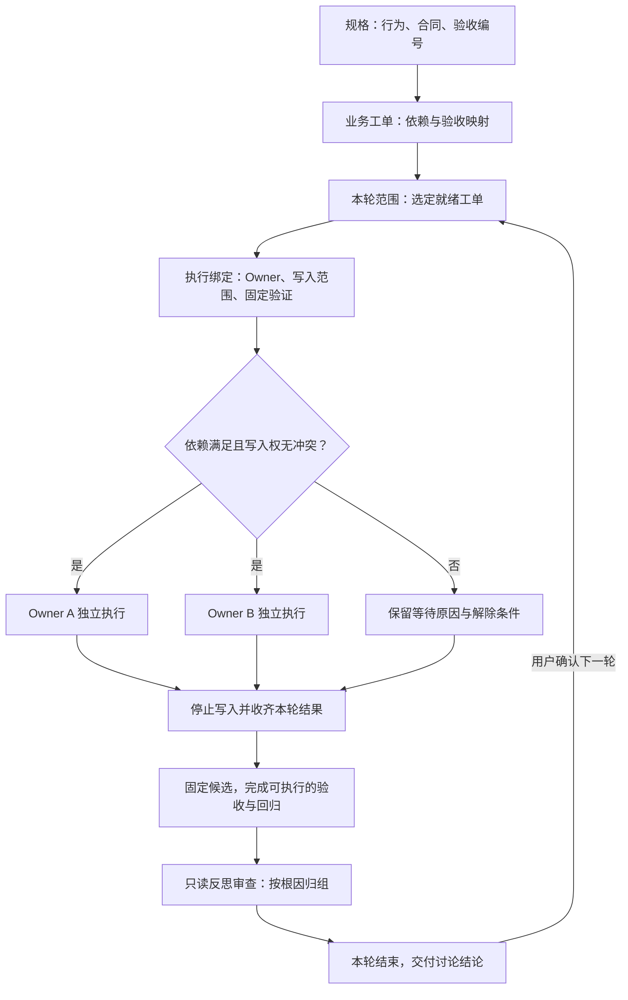

# DSH 工作流卡顿诊断与 Ghost Matt 整合建议

> 后续讨论说明：本文的故障证据保留；整合建议中“每轮结束等待用户确认”及前置 Owner 会诊的安排已被用户后续澄清替代。当前目标是主线程先形成 Spec/Ticket，再编排 DAG 自主执行，仅必要的需求决定返回用户。请以[讨论记录](discussion-record.md)、[ADR-0001](../../adr/0001-main-thread-spec-ticket-owner-execution.md)和[规格草稿 R1](../../superpowers/specs/2026-09-10-main-thread-spec-ticket-owner-dag-design.md)作为后续设计依据；不要将本报告后半部分的旧方案直接实施。

分析时间：2026-09-10。范围：当前工作区未提交版本的 `owner-workflow-plugin`、本机留存的 GhostNexus 工作流证据，以及用户指定的 `ghost-agent-market/codex-market/plugins`。这是诊断与方案，不是已经实施的改造。

## 结论

目前证据支持的主要问题，是规划与执行的控制流程不容易收敛。没有证据说明所有失败都来自 DAG 拓扑成环，也没有证据说明 DSH 的底层代理引擎本身必然死循环。

- 一条历史失败已明确定位：固定验证入口不存在，Owner 请求变更计划，审批失效后仍被重新派发，最后停在“计划未通过审查”。
- 当前版本已经补上 handoff 优先恢复；把这份历史状态交给当前决策器，会得到正确的 `handoff-replan`。这只证明路由修复，不代表整条历史流程已重跑成功。
- 当前收敛模块仍把 Owner 自然语言会诊内容计入证据摘要。两个意思相同的表述交替出现，就能不断刷新“新证据”，重置恢复策略。在确定性反例里，30 轮后仍继续改写计划。
- 当前代码还把 Reviewer 不再列出的问题视为已解决，并用“用户”等宽泛词识别外部授权，分别会产生虚假进展与错误等待。
- Ghost Matt 的优势是规格、工单、开发、测试、反思与讨论有清楚的结束边界。DSH 的优势是 Registry、Owner lease、隔离工作区、固定验证与提交审计。建议让前者定义工作节奏，让后者执行权限和事实约束。

不建议把 Ghost Matt 的全部说明文字塞进现有 Planner，继续由全自动修订循环调度。那样既保留当前循环问题，又增加一套与其相反的行为规则。

## 1. 证据范围与验证结果

当前仓库 HEAD 为 `1549140` 开头的提交，但存在大量原有未提交改动；本报告分析的是磁盘内容，不能用该 HEAD 代表被测代码。关键文件指纹见 `source-fingerprints.json`。

已运行现有定向测试：

```sh
cd /Volumes/LargeStorage/code/DSH-Workflow/owner-workflow-plugin
/Users/admin/.local/share/fnm/node-versions/v24.12.0/installation/bin/node --test --test-force-exit \
  test/workflow-state.test.mjs test/convergence.test.mjs test/runner.test.mjs
```

结果：25 项通过，0 项失败。完整输出见 `existing-tests.log`。这覆盖状态决策、收敛函数和 Runner 的既有测试，不是接入真实模型的全链路验收。

另运行诊断反例：

```sh
/Users/admin/.local/share/fnm/node-versions/v24.12.0/installation/bin/node --test \
  /Volumes/LargeStorage/code/DSH-Workflow/docs/analysis/2026-09-10-dsh-matt/convergence-repro.mjs
```

结果：5 项中 2 项通过、3 项失败。失败是诊断预期：断言的是应有行为，当前实现不满足。没有为了得到绿灯修改生产代码或断言。

```text
constant evidence 6 autonomous_incident
reworded consultation 30 local_subgraph_rewrite new_evidence []
omitted obligation obligation_reduced [ 'resolved' ] 1
historical state under current control handoff-replan handoff_replanning
tests 5 / pass 2 / fail 3
```

最初使用 PATH 中的 `node` 未启动成功，随后使用明确的 Node 路径完成了以上执行；未把工具启动失败算成项目缺陷。

限制：没有启动真实模型、没有重放完整 Owner 执行、没有操作历史业务仓库。Catalog 中 WalletConnect 对应的 Coinhub 旧路径已不存在，所以不能断言这三个当前缺陷就是那一次 WalletConnect 运行的全部原因。GhostNexus 留存的四份 workflow 中，两份为 `completed`，一份 `cancelled`，一份 `blocked`；不能据此描述为所有历史运行都失败。

## 2. 一条已经确认的历史失败链

来源：

- `/Volumes/LargeStorage/code/GhostNexus/.dsh-workflow/logs/wf-mt77s2c2-e6439af0.jsonl`
- `/Volumes/LargeStorage/code/GhostNexus/.dsh-workflow/workflows/wf-mt77s2c2-e6439af0.json`

以下时间采用原日志 UTC：

| 时间 | 事实 | 意义 |
| --- | --- | --- |
| 08-24 12:36:40 | 计划审查通过 | 此次不是一直没生成出 DAG |
| 12:38:44 | T1 的 `android_static` 通过 | 实现与静态验证已经取得进展 |
| 12:43:40 | T2 的 `android_static` 再次通过 | 不是所有验证都失败 |
| 12:43:41 | `android_unit` 返回 127；cwd=`flutter_app/android`；stderr=`bash: ./gradlew: No such file or directory` | 首个直接失败是验证入口不可执行 |
| 12:44:13 | T2 请求 handoff；理由是 review task 的 write 为空，不能补 wrapper 或改固定命令 | 执行者知道需要修改计划，但没有对应写入权限 |
| 12:44:26 | Owner 在提交关卡未成功后结束；workflow 标记 failed | handoff 与普通执行失败发生交叠 |
| 12:44:28 | 再次派发 T2 报“尚未通过当前计划的独立审查”；T3 随后 blocked | 计划审批已失效，却继续沿执行路径派发 |

最终状态同时包含：`planApproved=false`、缺少 `planReview`、pending handoff、T1 completed、T2 task_failed、T3 decision_required。

所以这里有两个层次：

1. **起因：固定测试入口未验证可用。** 127 是命令没找到，不能等同于业务断言失败。
2. **放大机制：交接改变了计划有效性，但执行恢复仍尝试旧调度路径。** 用户看到的是 DAG 卡住，内部实际发生的是审批、handoff、失败恢复状态互相冲突。

当前 `workflow-state.mjs:321` 起已明确让 pending handoff 优先于 Owner 再派发；现有测试也覆盖这个场景。历史状态回放到当前纯决策器，确实得到 `handoff-replan`。应保留这项修复，并补全跨真实调用边界的回放测试，而不是把它重新归因成尚未修复的同一个路由缺陷。

DSH 本仓库的 daemon 日志另有一次 `ENOSPC`，以及 running/blocked reservation 状态冲突。磁盘耗尽属于独立的运行环境故障，不能拿它解释所有规划循环。

## 3. 当前仍能复现的问题

### 3.1 文本变化被当成新证据，恢复策略可以不断重新开始

调用链：

`revisePlan` 的会诊与保存（`runtime.mjs:8135`、`:8266`）→ `workflowEvidenceDigest` → `reconcileReviewConvergence`。

`convergence.mjs:135` 将 Owner 会诊中的 `scopeFit`、`facts`、`constraints` 等字段纳入摘要；其中 facts/constraints 来自模型自然语言，做文字清洗后仍不能保证语义稳定。

`:226` 只要本轮摘要不同，就认为 evidenceChanged；`:253` 据此清空 usedStrategies。因此：

```text
同一缺失的验证入口
→ Owner 换一种表述
→ evidenceDigest 改变
→ progress = new_evidence
→ 已尝试策略清零
→ 再次 local_subgraph_rewrite
```

反例固定计划、workflow HEAD、任务和文件事实，只交替使用“仓库仍缺少固定验证入口”和“固定验证入口目前仍未找到”。30 轮后仍为 `new_evidence`，策略列表为空；完全相同的文字对照组第 6 轮进入 `autonomous_incident`。

这证明当前收敛函数存在可无限续期的输入序列。它不是完整模型运行的耗时复现，但属于真实收敛代码接缝上的确定性反例；当前初始计划修订确实会重新会诊并保存该字段，因此不是完全不可达的假设输入。

**建议：** 文本判断与执行证据分开存储。会诊结论可以指导下一步，但不能单独续期。可续期证据必须带稳定身份和来源，例如文件内容摘要、固定命令及候选摘要对应的结果、明确的合同修订、实际新增并核验的事实。还要识别 A→B→A 的证据反复，不能只与上一轮比较。另设本轮总时长/调用预算，避免指纹缺陷导致无限运行。

### 3.2 Reviewer 没再提的问题，会被直接标成 resolved

`convergence.mjs:227`：之前的 open obligation 只要不出现在当前 review，就进入 resolved。该判断没有要求关闭证据。

反例保持 evidenceDigest 完全相同，第一轮报告“固定验证入口缺失”，第二轮只报告“Owner scope 边界不明确”。旧问题立即变为 resolved，进展标记为 obligation_reduced，新问题则进入 unsupportedNewObligations。

这说明“冻结证据义务”目前没有可靠的关闭协议。不能把它表述成 Reviewer 一定在无限增加要求；当前代码已经试图约束新增问题，但仍把问题遗漏视为进展。

另一个需要改进的点是 `sameObligation`：相同 category 和 targetTaskIds 可被视为同一义务，粒度较粗。不同问题可能合并，任务编号变化也可能使身份漂移。这是静态发现，未在本轮扩展为更多反例。

**建议：** obligation 使用稳定 ID；关闭要求显式 `resolvedObligationIds + evidenceRefs`，并核对候选/来源。结构性问题可用确定性计划差异和合同依据关闭；执行性问题用测试或文件事实关闭。未再提及保持 open。新增真实风险允许登记，但必须解释来源及本轮影响，不能靠冻结规则掩盖风险。

### 3.3 技术讨论可能被误判为必须等待外部授权

`convergence.mjs:14` 的 AUTHORITY_PATTERN 包含“用户”“生产”“token”等宽泛词；`:210` 在 needs_decision 的问题中匹配到任意一个就要求用户权限。

反例：“用户取消连接时应如何释放资源？”会返回 true。单凭这句话并不能证明需要外部授权；它可能是技术生命周期问题，也可能需要产品讨论，应由缺失的决定和已有规格共同判断。

**建议：** 区分 technical_issue、product_decision、credential_missing、external_permission、environment_failure，并附当前不能继续的具体原因。用户主动选择的“本轮结束后讨论”是工作节奏，不应该依赖外部授权分类来实现。

### 3.4 状态表覆盖不等于流程一定有终点

`workflow-state.test.mjs:181` 的交叉状态测试验证每个组合都能返回 command/wait/terminal/invariant。这个测试有用，但连续返回同一个 command 也完全满足它。

要验证“不陷入循环”，还需要连续事件测试：同一证据重复 N 次会怎样、命令执行后状态有没有推进、wait 等谁、谁负责唤醒、总预算耗尽会落到哪里。

目前 25 项定向测试全绿，与上述 3 个反例失败并不矛盾：它们验证的性质不同。

## 4. 为什么这个设计容易停在规划附近

当前插件把正式 Owner Registry、批准过的 DAG、固定验证、只读 review/verify、Owner 提交、handoff、计划修订、实现审查、自动 repair 和长期记忆接在一条长流程上。`runtime.mjs` 当前为 14,346 行；问题不在行数本身，而在同一个对象承担了许多不同生命周期。

尤其有三个相互作用：

- 可执行 work leaf 必须绑定 verification；review/verify 的 write 必须为空。规则本身有价值，但“验证入口尚未建立”应成为一个明确的前置工作项。否则规划要承诺未来入口，执行时入口不存在，只读任务又不能修复它，只好再次改 DAG。
- 一个执行 task 只能绑定一个 Owner。直接把跨多模块的业务切片压成一个这样的 task，容易触发反复拆分、转交或 Registry 调整。
- 当前 completed 之后会自动触发 implementation-review，needs_repair 后自动产生 repair 子图；这与 Ghost Matt 的“本轮测试和反思后交付讨论”有实质差别。修改提示词不会改变 Runtime 的自动转移。

另外，历史日志显示 T1 的业务完成到最终 owner.finished 之间还有记忆整理。记忆失败也存在专门的恢复测试。建议让已通过的代码结果与记忆整理分别结算，记忆派生任务失败不应阻止无关下游任务。不过本次没有把记忆认定为那条 DAG 卡顿的直接原因。

## 5. Matt 原版与你的版本，实际差别在哪里

本节依据的是用户指定目录中的当前文件，不是公开上游的其他版本。

| 项目 | Matt `implement-spec` | 当前 `ghost-matt-implement` | 当前 DSH |
| --- | --- | --- | --- |
| 主要单元 | 规格和垂直切片工单 | 选定的一轮工单/AC | 单 Owner 的执行 task 与 DAG |
| 并行方式 | 每个 implementer 单独分支/worktree，完成后 merger 合并 | 当前分支/工作区；同一文件一个写入者 | Owner worktree、Owner 串行租约与正式 scope |
| 写入归属 | 没有同等明确的运行时写入分配 | 主线程登记和移交归属 | Registry + task.write + 提交审计 |
| 失败后 | 实施后审查并修复 | 收齐本轮测试，集中反思，停下讨论 | 多类自动恢复、重规划、自动 repair |
| Git | 草稿 PR + 多分支汇总 | 主线程独占 Git；不创建 PR | Runtime 固定 SHA 与受控合并 |

原版的不同 worktree 隔离的是工作目录和 Git 索引。它不能阻止两个人基于同一旧版本修改同一文件，也不能自动解决共享合同冲突。冲突会集中出现在 merger 阶段。

你的 Ghost 版本已经补上了规则层面的文件归属，不能再说它完全没有 owner 机制。它缺少的是 DSH 这类运行时约束：持久租约、失效 fencing、机器可校验的 scope、提交边界和恢复记录。

DSH 现有能力值得保留：

- `model.mjs:509` 起检查 Owner scope 重叠；`:828` 检查 task.write 是否落在 Owner 范围。
- `supervisor.mjs:310` 排除已在运行或本次已选中的 Owner，不会同时派两个任务给同一 Owner。
- `runtime.mjs:4324` 起提供 Owner 磁盘 lease、心跳和 token 校验。
- `owner-boundary.mjs:48` 起检查真实 Git 改动和最终提交。

但必须认清边界：当前 owner scope 是最终提交边界，Owner 可以在自己的 worktree 中临时改动其他路径再纠正。它不是逐次文件写入白名单。所以不能删除所有 Owner worktree、让大家共享一个目录后，仍声称原有 scope 审计足以防止彼此覆盖。

## 6. 建议的结合方式

### 6.1 明确三类独立概念

| 概念 | 回答的问题 | 示例 |
| --- | --- | --- |
| 业务工单 Ticket | 要交付什么可验收行为？ | 用户取消钱包连接后可以重新连接 |
| 长期 Owner | 哪个模块由谁负责和积累上下文？ | 连接适配器、会话状态、连接 UI |
| 执行任务 / 写入租约 | 本轮谁可以改哪些路径、持有哪个版本？ | T-03 的适配器部分，限定 adapter 文件 |

Ticket 不必等于 Owner，也不必等于一个 Runtime task。

一个跨层 Ticket 可以映射为少量 Owner 执行任务，保持同一规格修订和 AC 引用，最后在一个集成验收点验证完整行为。业务工单仍然是垂直切片；权限按模块分配；执行依赖由 Runtime 处理。首版用扁平 execution DAG 和 `ticketId` 映射即可，无须为此再开启递归 Composite 展开。

### 6.2 Ghost Matt 控制工作节奏，DSH 控制执行事实



建议职责：

- `ghost-matt-spec`：行为、合同、AC、未决事项。
- `ghost-matt-ticket`：工单依赖、共享前置改动、验收映射。
- 新的“轮次控制”职责：选择本轮范围、调度就绪工作、收齐结果、关闭本轮。
- Owner Runtime：权限、租约、执行、固定验证、结果与 Git 边界。
- `ghost-matt-run-test` 的方法：冻结候选、独立项继续、超时与完整证据。
- `ghost-matt-test-report` 的方法：按规格映射覆盖率，区分未运行、失败与通过。

移植的是这些行为合同。Codex 版本里写死的 `collaboration.spawn_agent`、模型名、参数以及本机 skill 路径，不能原样当成 DSH 接口。调用仍由现有 Harness 子代理适配层完成。

### 6.3 增加“本轮结束”的真实状态

建议新模式的主状态为：

```text
ready → executing → testing → reflecting → awaiting_discussion
```

取消、工程阻塞和外部等待各自记录原因。进入 awaiting_discussion 后不自动创建 repair 子图，也不自动领取范围外工单。下一轮根据明确的继续指令生成新的 roundId。

建议持久记录：roundId、specRevision、本轮 ticketIds/AC、候选来源、写入归属、测试范围、结果、阻塞及下一轮建议。依赖 Runtime 状态派生 UI，避免 Markdown 和 JSON 各自维护一份可写调度真相。

实施中的有限调试仍然允许；同一问题重复出现、边界变更或合同不明时停止相关任务，其他独立工作继续。不要等到“所有自动策略都试尽”才把本轮事实交出来。

现有 `owner_submit` 的有效提交保证仍保留。失败时可以结束本轮并保留 worktree、脏改动、日志和失败原因；不能为了结束本轮把它冒充 completed，也不能把失败候选自动并入可交付主分支。开发结果、验收结果和可交付结论分别表示。

### 6.4 并发以写入冲突为约束

建议首版保留现有 Owner worktree，减少每个 task 都分支的成本；使用者选择了当前工作区模式时，再实现相应的写入保护。不要在这次分析中切换用户分支或迁移现场。

规划依赖与资源互斥是两回事：

- “B 使用 A 生成的共享协议”是依赖边。
- “A 和 B 都可能改 lockfile”是写入冲突，需要指定唯一负责人或串行。
- “两个测试使用同一个端口、数据库或 build 输出目录”是运行资源互斥，即使源码无交集也可能冲突。

Registry 给出可授权的最大范围；每次执行拿更小的 writeSet。无法确定交集时保守串行。越界需求先停止相关写入，再由编排者分配，不让两个 Owner 私下扩大 scope。

例如两个钱包相关工单都需要改 `package.json`、依赖锁文件和共享会话类型：先给一个共享前置任务唯一写入权，验证后让适配器与 UI 消费同一版本。单纯为二者创建不同分支只会推迟冲突。

提交/合并保持单一权威，合入最新集成候选后运行相关验收。不存在文本冲突不等于没有语义冲突。如果后续引入共享工作区模式，必须覆盖实际编辑工具与 Shell 写入路径；只有提示词和最终 diff 审计不够。

### 6.5 将验证入口就绪与测试结果分开

规划阶段检查已存在的 cwd、命令入口、依赖与权限条件；未来才会创建的测试入口明确由前置任务产出。入口未就绪时解除条件可见，不要求 Planner 重写整个方案。

执行记录区分：入口缺失、环境阻塞、编译失败、断言失败、超时、未运行、通过。只读审查者可以返回这些事实，而不是被迫修改它没有权限修改的命令或代码。

正式验收时停止候选写入，绑定实际内容指纹。独立套件的失败不阻断其他独立项采集。最终只有对应证据完整的 AC 才通过。

## 7. 建议实施顺序与验收

| 顺序 | 最小改动 | 应证明的行为 |
| --- | --- | --- |
| 1 | 将本报告 3 个反例转成正式回归，修正证据续期、义务关闭、授权分类 | 换说法不能续期；遗漏不能关闭；技术问题不因关键词误停 |
| 2 | 增加显式 round 模式与结束状态，阻断该模式的自动 repair/下一轮 | 一轮失败仍交付完整结论；没有继续指令不派新任务 |
| 3 | 增加 spec/Ticket/AC 到现有 Owner task 的薄适配层 | 一个跨 Owner 的 Ticket 有清楚的执行映射和集成验收 |
| 4 | 保留 Owner lease/隔离/审计，补共享文件与测试资源的占用表示 | 两个任务申请同一路径时只有一个成功，另一个显示等待原因 |
| 5 | 将验证入口预检、整轮证据和派生记忆从业务完成判定中分清 | 缺命令报告环境事实；记忆失败不把已核验代码重新判失败 |

第一条端到端场景建议只包含：一份规格、两到三个 Owner、小量工单、一个共享前置改动、一个跨模块行为、一个故意缺失的测试入口。验证以下关键性质：

1. 无冲突任务可并行；同文件任务不能同时获得写入权。
2. 同一事实重复审查有确定的停止点。
3. handoff 之后不会沿失效审批继续派发。
4. 缺失测试入口有明确责任和解除条件，不丢失已完成任务。
5. Runtime 重启后从同一 round/lease/结果恢复，不重复提交。
6. 一轮测试收齐后进入讨论状态；下一轮需要明确继续指令。
7. 相同候选上的验收证据可追溯；不能只看 HEAD 忽略未提交改动。

暂不优先增加更多 Planner/Reviewer/Arbiter 角色、递归拆解或自动恢复策略。先证明一个小流程能执行、能失败、能收齐事实、能停下，再扩展自治程度。

## 8. 本次产物

- `analysis.md`：本报告。
- `convergence-repro.mjs`：调用当前源码的确定性诊断反例；包含一个依赖本机历史状态路径的回放用例。
- `convergence-repro.log`：2 通过、3 失败的原始诊断结果。
- `existing-tests.log`：现有 25 项定向测试结果。
- `source-fingerprints.json`：当前关键源文件内容指纹与仓库 HEAD。
- `workflow.mmd`：建议的轮次流程源码（本报告内也直接展示 Mermaid）；外部渲染服务超时，未生成 SVG。

未修改生产逻辑、未修复历史业务项目、未创建分支/worktree、未提交或推送。所有原有修改保留。
