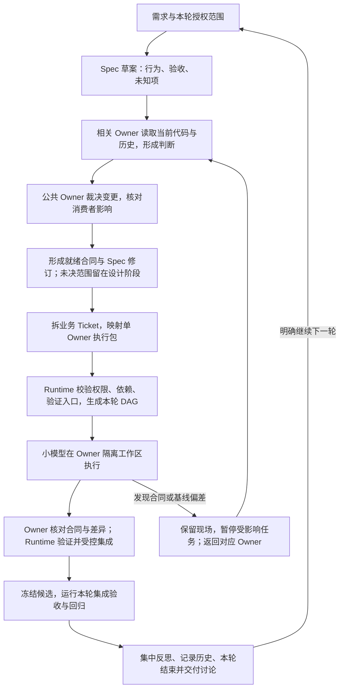

# Owner 主导决策的工作流调整建议

状态：早期讨论稿，已被后续讨论部分替代；仅保留演进历史，未改动运行代码。

> 当前方案见[讨论记录](discussion-record.md)和[规格草稿 R1](../../superpowers/specs/2026-09-10-main-thread-spec-ticket-owner-dag-design.md)。用户后续明确：Spec/Ticket 在主线程形成，之后才编排 DAG；除需求讨论及必要决定外希望不再参与。因此本文的“逐轮 awaiting_discussion / 确认下一轮”和“先完成独立 Owner 会诊再形成 Spec”不再是目标要求。Owner 长期责任、公共模块独立判断、执行隔离与证据约束继续保留。

来源：2026-09-10 用户确认的 Owner 定义、当前 Ghost Matt 流程、DSH 当前实现与本目录 `analysis.md` 的诊断结果。

用户已经明确的要求：

1. Owner 持续掌握模块的修改历史、原因、具体版本与现状。
2. 下游要求公共模块修改时，公共模块 Owner 独立判断合理性与下游影响。
3. 将思考前置，拆成准确的执行任务，减少小模型自行猜测。

## 1. 调整后的主线

DSH 应从“Planner 持续生成、审查和修订执行 DAG”，调整为“编排者组织 Owner 完成合同判断，再把已确定的工作编译成执行 DAG”。

思考仍可迭代，但必须有具体待决问题、负责者、版本和结束条件。DAG 是已确定执行工作的投影，不承载无限设计讨论。

该图表达职责顺序，并非要求每个框都创建一个模型会话。简单修改可以由同一轮 Owner 判断完成多个步骤；Owner 数量和调用次数按影响范围增长。

“本轮”从选定范围开始，包含该范围的必要设计、执行、测试和反思。执行前的局部设计回退也消耗同一轮预算，不能借创建新 cycle 或重排 DAG 无限续期。更大合同或范围变化进入本轮结论，下一轮再实施。

## 2. 职责分配

| 角色 | 有权决定的事情 | 输出 |
| --- | --- | --- |
| 用户 | 产品取舍、范围、真实外部授权、明确下一轮方向 | Intent 与决定 |
| 主编排者 | 组织相关 Owner、核对合同一致性、选择本轮范围、协调资源和形成总报告 | 规格、工单、轮次记录 |
| 模块 Owner | 模块现状、变更合理性、接口与兼容方案、模块内部实现边界 | Owner 判断、合同变更建议、执行包、结果审查 |
| 小模型执行者 | 在执行包内完成局部编码和定向验证 | 修改、测试事实、偏差报告 |
| Runtime | 权限、租约、版本绑定、依赖调度、固定验证、Git 与持久状态 | 可核验执行记录 |

Owner 是跨任务稳定的身份与责任，不必是永远存活的长会话。每次由短期会话恢复“当前合同 + 相关历史 + 当前代码证据”。这样既保留长期责任，又不会积累无限上下文。

Owner 决策会话和执行会话属于同一个责任域。初版可顺序创建；无需引入 Owner 自行派生子代理的权限。它们都由现有 Runtime 创建和绑定，兼容当前 Owner 不允许生成后代代理的规则。

用于设计判断的能力要求通常高于局部执行，但本方案不预先绑定某个模型品牌或型号；后续用固定任务集比较结果和成本。

## 3. 各阶段具体怎样工作

### 阶段 A：建立 Spec 草案

主编排者从讨论中形成行为目标、范围、AC 编号、已有决定和关键未知项。先描述完整业务行为，不按 Owner 分裂用户需求。

输出不是“所有问题均已解决”的规格，而是可供相关 Owner 判断的草案。已批准的范围和决定直接复用，不因每次内部任务拆分重复要求用户批准。

完成条件：Owner 能明确知道需求是什么、哪些是约束、哪些需要它裁决。

### 阶段 B：Owner 基于当前版本判断

编排者根据 Registry、代码依赖和相关证据选择受影响 Owner；不默认全体会诊。

每个 Owner 检查：

- 当前模块是否已经支持目标，真实调用点在哪里。
- 当前合同、历史取舍及其理由是否仍然成立。
- 所需修改是否落在自身责任范围。
- 是否需要公共模块或其他模块提供能力。
- 需要什么验证，哪些验证入口已经存在，哪些应由前置任务建立。

Owner 返回稳定编号的判断与问题，引用当前源码/版本或其他证据。自然语言可以解释原因，但不能凭文本变化刷新运行预算或关闭问题。

完成条件：本 Owner 的方案可以实施，或者存在明确指向另一个负责者的变更请求。

### 阶段 C：处理公共模块变更请求

请求最少说明：请求方、目标 Owner、需要的行为、现有能力不足的证据、涉及的合同版本、候选方案及未知项。

公共 Owner 独立决定：

1. 现有能力已足够：给出正确接入方案。
2. 接受兼容扩展：明确新增能力、保持不变的行为和验证。
3. 需要迁移：明确新旧合同过渡、消费者适配以及旧形式移除条件。
4. 当前请求不合理：说明冲突约束及替代方案。
5. 证据不足：指定缺少的事实与获取方式。

“独立思考”意味着请求不能直接变成命令，也不意味着公共 Owner 可以单方面决定所有消费者的业务行为。Runtime/编排者协助定位调用方，受影响消费者 Owner 核对各自的兼容性与适配工作。

公共模块不一定等于 Registry 父 Owner：公共关系来自代码依赖，Registry 父子关系用于责任范围划分，二者不可混同。

模块调用关系有环时，不能照抄为执行依赖环。相关 Owner 先形成一组兼容合同，再按可执行顺序安排工作；大范围不兼容变化采用兼容扩展、消费者迁移、旧合同移除。无法分阶段保持有效时，明确安排共同集成候选与最终验收，不宣称局部完成就是整体可用。

完成条件：变更理由、合同与兼容策略、影响范围、迁移责任均明确。无影响的消费者不需要逐个审批；也不能仅凭公共 Owner 声称“无影响”就跳过证据检查。

### 阶段 D：形成就绪规格与拆解工单

Owner 的有效判断合并回一个 Spec 修订。规格仍是业务行为与模块合同的统一来源；每个就绪范围有对应 AC。尚未确定的部分显式留在设计阶段，不进入可执行 DAG。

复用 Ghost Matt 的业务切片方法建立 Ticket。一个 Ticket 可以涉及多个 Owner，但具体执行包必须绑定一个 Owner。

初版只保留两层：业务 Ticket → 单 Owner 执行包。不要为思考、审查、记忆整理等所有步骤再创建多层 Composite DAG。

每个执行包至少包含：

| 内容 | 用途 |
| --- | --- |
| Ticket、AC、Spec/合同修订引用 | 让执行者知道依据是什么 |
| Owner 与基线内容标识 | 防止使用过期现场 |
| 要实现的具体行为、输入输出示例 | 限制模型重新设计 |
| 可修改范围、必须保持的行为 | 约束写入与兼容性 |
| 依赖产物及其就绪条件 | 防止消费者提前执行 |
| 定向验证与证据要求 | 确定局部完成标准 |
| 偏差上报与停止条件 | 避免越界猜测 |

文件清单在派发前核实，可以声明受控目录或文件族；不要求 Spec 阶段预测每个未来文件名。执行中需要扩展写入范围时重新取得授权绑定，不能由小模型自行扩大。

完成条件：小模型可以开始编码，不必重新决定产品取舍、公共接口或跨模块责任。

### 阶段 E：Runtime 编译、预检与派发

Runtime 校验并固定执行包：Owner 来自正式 Registry；writeSet 在 scope 内；依赖引用存在且执行图无环；合同修订一致；验证绑定合法；现有命令入口和 cwd 可用。

未来才会创建的验证入口，必须声明生产它的前置执行包。在该前置结果集成、入口经检查后，消费者才获得执行资格。不能让只读验证任务临时猜测或修改命令。

将三类约束分别处理：

- 数据/合同依赖：由执行 DAG 表示。
- 写入互斥：由 Owner lease 和当前执行包范围表示。
- 运行资源互斥：数据库、端口、构建输出等占用单独表示。

首版保留一个 Owner 同时一个执行者以及 Owner 隔离 worktree。业务 Ticket 跨 Owner 时允许并行；同一共享文件由唯一 Owner 负责。隔离目录内的最终提交审计继续保留，不能把它误认为共享目录中的逐次写入保护。

设计修订与代码执行分别绑定版本；新的设计说明不会悄悄扩大正在运行任务的写权限。

### 阶段 F：执行与有限回退

执行者按合同编码并运行必要定向检查。局部实现错误可以在同一执行包内修正，但受本轮已固定预算和重复失败策略约束。

发现偏差时按责任返回：

| 偏差 | 去向 | 是否自动改 DAG |
| --- | --- | --- |
| 局部实现不符合已确认合同 | 当前执行者，由 Owner 提供必要判断 | 通常不改 |
| 代码基线或文件范围与执行包不符 | 当前 Owner | 先核实，不自动扩权 |
| 公共合同缺失或冲突 | 对应公共 Owner 与受影响消费者 | 有明确合同修订后才改 |
| 固定验证入口/环境不可用 | Runtime 提供事实，相关 Owner 判断修复责任 | 仅在需要新增或变更执行工作时改 |
| 产品取舍或真实外部授权缺失 | 主编排者向用户集中提出 | 决定到达后处理 |

偏差报告至少包含预期、实际、证据、受影响任务与提出的问题。暂停受影响依赖闭包，独立任务继续；保存旧工作区与结果，不能自动清理用户或执行者现场。

技术问题先由负责 Owner 与主编排者根据既有意图裁决。超出本轮预算或需要重大合同/范围变化时，形成完整结论并结束本轮，不自动转成“继续尝试所有策略”。

### 阶段 G：Owner 核对与 Runtime 集成

Owner 核对实际 diff 是否符合变更理由、模块合同、历史约束及执行包范围。把结果绑定到具体候选内容；Owner 的“通过”不能代替固定测试。

Runtime 负责边界检查、固定验证、提交和串行集成。语义审查与提交候选绑定；审查后内容发生变化时重新判断受影响证据，不能复用旧结果。

小任务可复用该 Owner 的短期决策上下文完成结果核对；高影响公共合同变更和最终跨模块行为需要适当的独立检查。避免每个微小节点都无条件创建一套额外审查代理。

局部完成必须区分：已经实现、固定验证通过、已集成、业务 AC 已通过。公共模块结果只有完成所需集成和合同检查，才解除下游执行依赖。

失败候选可以保留并进入本轮报告，但不会因此被标为 completed 或自动并入可交付基础分支。

### 阶段 H：整轮验收、反思和历史记录

停止相关写入，固定实际集成候选。运行本轮 AC 验收与受影响回归；独立项失败后继续收齐其他可执行项的证据。按实现、合同、环境、测试装配等根因归组。

Owner 记录本次变更原因、代码版本、合同修订、验证结果、未决问题，以及旧决定为何被保留或替代。原始事件和版本记录在提交/集成时可靠持久化，不能等语言模型整理记忆成功才记账。

长期记忆分为：不可变历史记录、当前合同与状态投影、便于检索的解释摘要。摘要整理失败时标记待整理；已确认代码结果不因此失效。下次 Owner 仍可读取原始记录恢复判断。

默认沿用当前 Ghost Matt 的逐轮节奏，进入 `awaiting_discussion`，交付完成范围、测试结果、原因分析与下一轮建议。下一轮需要明确继续指令，不能靠后台 daemon 自行启动。

当前用户是在讨论调整方案，尚未授权用本方案实施插件或启动下一轮开发。

## 4. 怎样保证思考阶段也会结束

Owner 协商如果缺少约束，也可能替代 Planner 成为新的循环。必须同时满足：

1. 每个待决问题有稳定 ID、负责 Owner、待确认事项和证据来源。
2. 其他 Owner 提意见时引用问题或提出带来源的新问题，不能反复改变同一个请求的目标。
3. 关闭问题需要明确决定及证据；未在新报告出现仍保持未解决。
4. 同一轮内只有实际事实或经确认的合同变化算进展；表述变化不算。历史已见事实不能反复充当新证据。
5. Owner 给出决定后，相关合同版本冻结；消费者根据事实申请修订，不自行改变。
6. 每轮固定范围和总预算，预算不能被文本摘要、重启代理、生成新节点或切换策略清零。
7. 预算耗尽时有可交付的终点：已达成决定、未决问题、责任人、证据与建议。不是无负责人地继续等待。

界面上的 wait 必须区分：等待执行依赖、等待资源、等待具体 Owner 判断、等待外部条件、等待用户讨论。每种等待显示负责者或外部条件、解除条件，以及适用的截止/通知规则。

工程任务的有界失败不应伪装成外部权限需求。主编排者仍负责分析技术问题，但系统允许它在本轮无法证明可行时交付事实并停止。

## 5. 对现有插件的调整范围

| 当前部分 | 调整方向 |
| --- | --- |
| Intent / Spec | 保留用户意图来源；补规格、AC 与就绪范围引用 |
| Planner / Owner consultation | 将自由会诊摘要升级为有版本与证据引用的 Owner 判断；Planner 组织结果，不替 Owner 猜合同 |
| PlanRevision | 将合同/设计修订与可执行计划区分；仅已就绪工作进入活动执行版本 |
| `model.mjs` / Supervisor | 保留单 Owner 执行与确定性调度；增加 Ticket/合同映射，避免业务切片与执行包混为一谈 |
| Owner lease / worktree / boundary | 保留；按真实公共文件归属和资源使用约束并行 |
| `owner-agent.mjs` / skills | 分清 Owner 决策输入和小模型执行包；移除“缺合同也继续自行修”的歧义 |
| `owner-submission.mjs` / verification | 保留真实验证与提交保证；加入 Owner 审查候选绑定和明确失败分类 |
| `convergence.mjs` | 修复文本续期、遗漏关闭、关键词授权判断；加入不可重置的轮次边界 |
| `workflow-state.mjs` / external runner | 以轮次推进；支持显式设计等待、局部回退和 `awaiting_discussion`，该状态禁止自动 repair |
| Memory | 原始版本事实可靠记账；当前状态可校验；解释摘要允许异步派生 |
| Dashboard | 先展示阶段、阻塞原因、负责者和已完成行为；DAG 作为执行明细 |

这些是职责调整，不意味着立刻新增十几个独立服务。可先从 `runtime.mjs` 提取 Owner 判断与轮次控制两个清晰边界，复用已有执行内核。新工具名称、持久 schema、迁移策略在实施规格中进一步确定。

正式 Registry scope 的改变继续走现有治理与授权通道。模块内部的普通技术决定无需每次重新向用户请求 Registry 批准；Owner 同意合同也不等于获得生产发布或外部操作授权。

## 6. 落地顺序与首个验收场景

### 第一阶段：让流程能够可靠结束

先把已复现的三个收敛问题变成正式回归并修复。增加明确轮次终点，使失败可收齐证据并停止。旧 workflow 先保持历史语义，不在活跃现场自动迁移；新模式先用于一个小工作流。

### 第二阶段：打通 Owner 决策到执行包

实现一个下游 Owner 向公共 Owner 提请求、公共 Owner 分析另一消费者影响、冻结合同、生成执行包、派小模型实施的完整路径。使用扁平 DAG，不同时引入递归展开或更多自动恢复角色。

### 第三阶段：补全版本、影响与记忆

落实合同和候选版本绑定、局部失效传播、历史/当前状态区分、资源互斥及只读观测。根据首个场景的实际需求扩展，避免先建设通用平台再验证。

首个验收场景应有三个 Owner：公共会话模块、连接界面、已有的恢复消费者。连接界面提出公共行为修改，公共 Owner 必须发现并保护恢复消费者。

验收要求：

- 公共 Owner 能接受、拒绝或提出兼容替代；请求不自动变成实施命令。
- 同一业务 Ticket 的不同执行包均引用同一合同和 AC。
- 只有公共 Owner 能修改公共路径；下游不能因方便而越界。
- 公共结果就绪后下游才执行；无影响任务可以独立推进。
- 小模型发现执行包与现状不符时返回证据，不能偷偷改合同。
- 同一问题换说法不会续期或关闭；Owner 会诊本身有终点。
- 故意缺失一个测试入口时，报告精确原因并保留现场，不陷入审批失效后的重复派发。
- 修改公共合同后，受影响结果进入待检查；无关结果保持有效。
- 验收证据绑定真实候选，两个消费者均验证。
- 轮次结束后 daemon 不自动修复或开始下一轮。
- Owner 历史能回答这次为什么改、对应哪个版本、当前还有什么限制。

## 7. 本方案的边界

这是基于已确认 Owner 意图形成的流程建议。默认复用现有隔离执行机制与 Ghost Matt 的逐轮讨论节奏；不承诺某个模型必然成功，也不要求计划提前预测所有代码细节。

本次只新增此讨论稿；没有变更生产代码、现有规范、Registry、分支、worktree 或业务项目现场。
